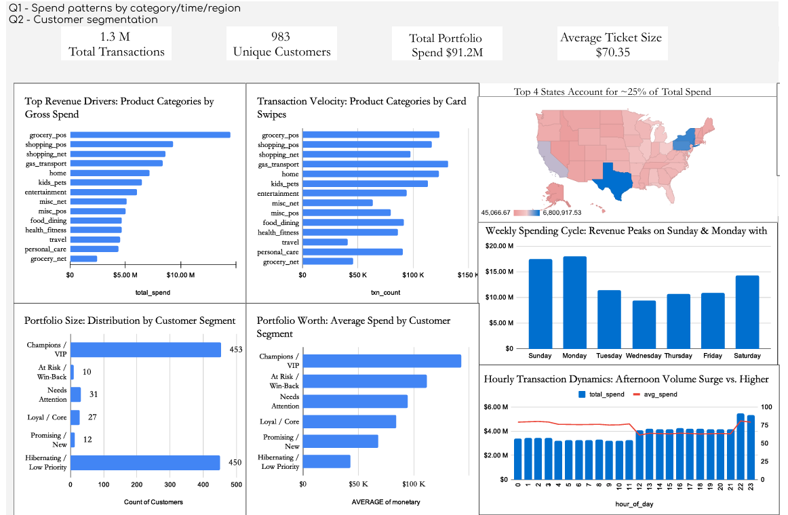
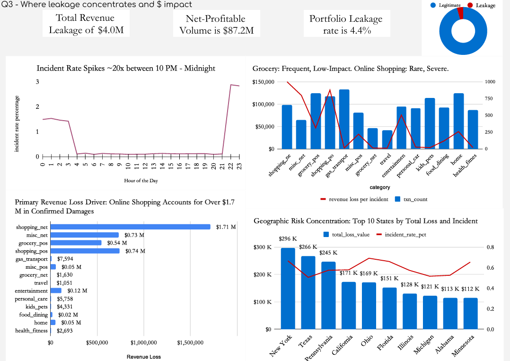

# Credit Card Portfolio Analytics Dashboard

## Summary

This project analyzes the Sparkov Credit Card Transactions dataset to understand customer behavior, portfolio profitability, and operational risk using SQL and Google Sheets.

The solution processes approximately **1.3 million transaction records** across **983 customers**, representing **$91.2M in portfolio spend**, and transforms the data into two interactive dashboards covering customer engagement and portfolio health.

The project combines customer segmentation (RFM), spending analytics, and revenue leakage analysis to demonstrate how analytics can support marketing, portfolio management, and fraud monitoring decisions.

## Dataset

**Source:** Sparkov Credit Card Transactions Dataset.

The dataset contains customer-level credit card transaction data including:

- Customer demographics
- Merchant categories
- Transaction amount
- Transaction timestamp
- Geographic location
- Fraud indicator

### Dataset Summary

| Metric | Value |
|--------|-------:|
| Transactions Analyzed | 1.3 Million |
| Unique Customers | 983 |
| Portfolio Spend | $91.2 Million |
| Revenue Leakage | $4.0 Million |
| Leakage Rate | 4.4% |
| Net Profitable Volume | $87.2 Million |

## Project Workflow

### Data Preparation

- Cleaned and transformed transaction-level data using SQL.
- Built analytical tables for customer, merchant category, state, weekday, hourly, and fraud analysis.

### Customer Segmentation

Calculated Recency, Frequency, and Monetary (RFM) scores using SQL Window Functions (`NTILE`) and classified customers into six business segments.

### Portfolio Analytics

Analyzed customer spending across:

- Customer Segments
- Merchant Categories
- States
- Day of Week
- Hour of Day

### Revenue Leakage Analysis

Measured portfolio leakage by evaluating fraudulent transactions across categories, locations, and transaction timing.

### Dashboard Development

Developed two interactive Google Sheets dashboards with KPI cards, Pivot Tables, charts, and slicers for business reporting.

## Key Business Insights

### Customer Segmentation

Built an RFM framework that classified customers into six actionable business segments.

The portfolio was heavily concentrated in two groups:

- **Champions / VIP (453 customers)** — High-value customers driving portfolio revenue.
- **Hibernating / Low Priority (450 customers)** — Low-engagement customers with significant reactivation potential.

The remaining customer segments represented opportunities for retention and portfolio growth through targeted engagement strategies.

---

### Spending Behaviour

Portfolio spend was concentrated across grocery, shopping, and transportation categories. Premium customer segments consistently generated the highest average spend per customer, highlighting the importance of customer lifetime value.

---

### Revenue Leakage

Although only **4.4% of transactions** were classified as fraudulent, they accounted for approximately **$4.0M in revenue leakage**, demonstrating the disproportionate financial impact of fraudulent activity.

---

### Time-Based Risk

Revenue leakage peaked between **10 PM and Midnight**, suggesting that adaptive authentication during these hours could reduce portfolio losses while minimizing customer friction.

---

### Geographic Trends

Both portfolio spend and fraud exposure were concentrated across a limited number of states, supporting region-specific monitoring and targeted fraud controls.

## Business Recommendations

Based on the portfolio analysis, the following actions can help improve customer engagement and reduce operational risk:

- **Strengthen customer retention** by targeting *At Risk* and *Needs Attention* segments with personalized offers and re-engagement campaigns.
- **Reward high-value customers** through loyalty programs, exclusive benefits, and proactive credit limit enhancements to maximize customer lifetime value.
- **Implement adaptive fraud controls** during high-risk transaction hours (10 PM–12 AM) to reduce revenue leakage while maintaining a seamless customer experience.
- **Increase monitoring for high-risk merchant categories** exhibiting higher fraud losses and revenue leakage.
- **Adopt region-specific risk monitoring** by focusing fraud detection efforts on states with consistently higher fraud exposure.

## Dashboard Preview

### Customer Engagement & Spend Dynamics

---

### Portfolio Health & Revenue Leakage

## Live Dashboard

🔗 **[View Interactive Google Sheets Dashboard](https://docs.google.com/spreadsheets/d/1QbdQ-ETJqQvjMqZKtil-4spmzikSONDgSFtmxoPielk/edit?gid=0#gid=0)**

- ## Technical Stack

| Category | Tools & Technologies |
|----------|----------------------|
| Database & Querying | SQLite, SQL |
| SQL Concepts | CTEs, Window Functions (`NTILE()`), Joins, Aggregate Functions, Subqueries |
| Dashboarding | Google Sheets |
| Visualization | Pivot Tables, KPI Cards, Dynamic Charts, Slicers, Conditional Formatting |
| Analytics | RFM Customer Segmentation, Portfolio Analytics, Revenue Leakage Analysis, Fraud Analytics |

## Future Improvements

- Rebuild the dashboards in **Power BI** or **Tableau** for enhanced interactivity and scalability.
- Develop a **Python-based ETL pipeline** to automate data cleaning and dashboard refresh.
- Incorporate **Customer Lifetime Value (CLV)** analysis to improve portfolio management strategies.
- Build **predictive models** for customer churn and fraud detection using machine learning techniques.
- Integrate SQL queries with BI tools for automated reporting and near real-time portfolio monitoring.
